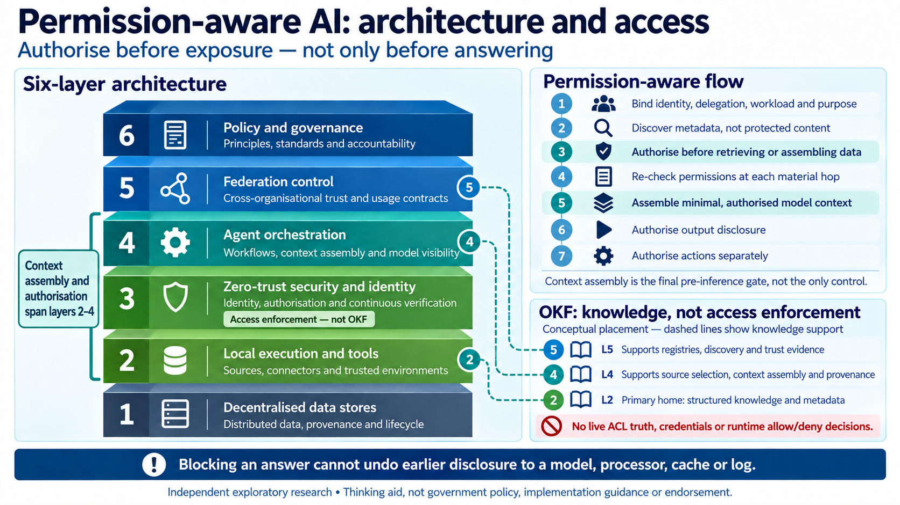

# Permission-aware AI: architecture and access

Presentation note for the six-layer OKF slide, 29 September 2026.

## Purpose and placement

Use this slide in the theory section, before “OKF-MCP: trust meets execution” and the demonstration. Allow about two minutes. The main message is that structured knowledge helps an agent find and assemble relevant evidence, while identity and access controls determine what it may retrieve, expose and do.

## Speaker notes

“This is a conceptual view of how knowledge and access controls fit together in an AI system. Read the stack from the bottom upwards: data stores; local tools and sources; security and identity; agent orchestration; federation between organisations; and policy and governance.

“OKF’s main home in this picture is layer 2. It provides structured knowledge, metadata and provenance. That helps an agent understand what a source contains, how records relate and where evidence came from. At layer 4, it supports source selection and context assembly. At layer 5, it can support registries, discovery and the evidence used to assess trust.

“Access enforcement remains a separate responsibility. OKF does not supply credentials, the current access-control list or the runtime decision to allow or deny a request. Those decisions need the security and identity controls shown at layer 3, with checks as information moves through tools and orchestration.

“The flow on the right makes the timing explicit. Establish the identity, delegation and purpose. Discover only metadata that the caller is permitted to see. Authorise retrieval before fetching or assembling protected information, and check permissions again at each material hand-off. Assemble only the authorised context needed for the task. Then check whether the output may be disclosed, and authorise any action separately.

“The important point is that information can already have reached a model, processor, cache or log before an answer appears. Blocking the final answer cannot undo that earlier disclosure. Context assembly is therefore a final check before inference, alongside the checks earlier in the journey.

“Our DWP demonstration uses public material. It explores structured evidence and provenance; this slide is a thinking aid for the wider architecture. It does not demonstrate that all these access controls have been implemented.”

## Transition to the demonstration

“With that distinction established, let’s look at how the agent discovers relevant DWP evidence, follows its relationships and retains the source references and qualifications in the assembled context.”

## Asset and authority notes

The image is an AI-generated conceptual presentation illustration. Its supplied metadata describes independent exploratory research, with no government policy status, implementation authority or endorsement. The dashed connections indicate knowledge support; they do not depict enforced access controls.

The supplied [metadata](6-layer-okf-20260929-metadata.json) records the original image name as `permission-aware-architecture-slide-v2.png`. The repository copy is named `6-layer-okf-20260929.png`; its SHA-256 and dimensions match the metadata. The referenced `receipt-v2.json` and `generation-prompt-v2.txt` were not supplied with these files, so the generation provenance has not been independently verified.
